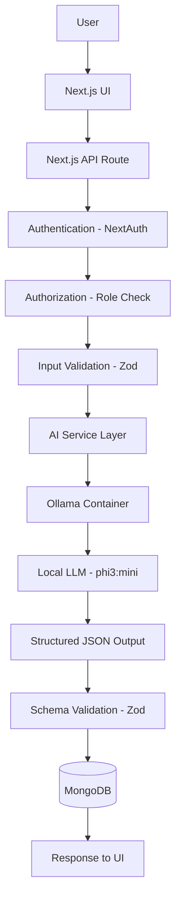

# AI Architecture

## Overview

The E-Learning MSC platform integrates local AI capabilities using Ollama as the LLM provider. The architecture follows a clean separation of concerns with a provider abstraction layer, centralized prompt engineering, and strict output validation.

## AI Use Cases

1. **AI Learning Assistant** — Students ask questions about course material; the AI responds based on the provided course context.
2. **AI Quiz Generator** — Instructors generate quiz questions from course content; the AI produces structured quiz data for review.
3. **AI Project Feedback** — Instructors get AI-powered analysis of student project submissions for advisory feedback.

## Architecture Diagram



## Request Lifecycle

1. **Browser** sends request to Next.js API route
2. **Authentication** — `requireRole()` verifies the user is logged in
3. **Authorization** — Role-based access control (student/instructor/admin)
4. **Input Validation** — Zod schema validates all request fields
5. **Course Access Verification** — Database checks user enrollment/permissions
6. **Context Retrieval** — Relevant course content fetched from MongoDB
7. **Prompt Construction** — Centralized prompt builder assembles system + context + user input
8. **AI Provider Call** — `generateStructured()` calls Ollama with JSON format constraint
9. **Output Validation** — Zod schema validates the AI response structure
10. **Response** — Validated data returned to the client

## File Structure

```
lib/ai/
├── index.ts              # Barrel exports
├── client.ts             # Ollama HTTP client (raw fetch)
├── provider.ts           # AIProvider interface + OllamaProvider
├── prompts.ts            # Centralized prompt builders
├── schemas.ts            # Zod schemas for all AI outputs
├── assistant.ts          # Learning assistant business logic
├── quiz-generator.ts     # Quiz generation business logic
├── project-reviewer.ts   # Project feedback business logic
└── errors.ts             # AI-specific error types

app/api/ai/
├── assistant/route.ts    # POST /api/ai/assistant
├── quiz/route.ts         # POST /api/ai/quiz
├── quiz/drafts/route.ts  # GET/POST /api/ai/quiz/drafts
├── project-review/route.ts # POST /api/ai/project-review
└── health/route.ts       # GET /api/ai/health

components/ai/
├── index.ts              # Barrel exports
├── learning-assistant.tsx # Student chat widget
├── quiz-generator.tsx    # Instructor quiz builder
├── project-feedback.tsx  # Instructor feedback display
└── ai-badge.tsx          # AI-generated badge

models/
├── AIConversation.ts     # Conversation history
└── AIQuizDraft.ts        # Quiz drafts for review
```

## Provider Abstraction

The `AIProvider` interface allows swapping LLM providers without changing application code:

```typescript
interface AIProvider {
  generate(options: AIGenerateOptions): Promise<AIGenerateResult>
  healthCheck(): Promise<AIHealthResult>
  readonly name: string
}
```

Current implementation: `OllamaProvider`
Future options: `OpenAIProvider`, `GeminiProvider`

## Security

- All AI endpoints require authentication
- Role-based access: students → assistant only; instructors → quiz + project review
- Ollama URL and model config are server-side only (never exposed to browser)
- User/course content treated as untrusted input (escaped in prompts)
- System prompts never exposed to users
- Input length limits enforced via Zod schemas
- AI output validated before use — malformed responses rejected

## Human-in-the-Loop

- Quiz Generator produces **drafts** — instructors must review/edit before publishing
- Project Feedback is **advisory** — instructors make final evaluation decisions
- AI-generated content is clearly labeled with badges
- No automated pass/fail based on AI output

## Docker Integration

```yaml
services:
  ollama:
    image: ollama/ollama:latest
    volumes:
      - ollama_data:/root/.ollama
    ports:
      - "11434:11434"
```

Inside Docker, the app communicates with Ollama via `http://ollama:11434` (Docker service name).
On the host, Ollama is accessible at `http://localhost:11434`.

## Model Selection

**Selected model: `phi4-mini` (3.8B parameters)**

Rationale:
- Small enough to run in Docker with 4-8GB RAM
- Good structured output quality for JSON generation
- Fast inference for interactive use
- Supports system prompts well
- Reliable for educational content generation

Alternative: `llama3.1:8b` for higher quality (requires more resources).
